# Order Processing System - Architecture Documentation

## 1. Introduction & Goals

### 1.1 Requirements Overview

**Business Goals**
- Enable end-to-end order processing with payment validation and inventory management
- Support scalable, event-driven architecture for future growth
- Establish clear service boundaries with independent deployments
- Deliver MVP1 with simplified integrations, deferring complex external systems to MVP2

**Primary Use Cases**
- UC-1: Customer places order (validates payment, reserves inventory)
- UC-2: Payment processing (transaction recording, success/failure notification)
- UC-3: Inventory management (stock reservation, allocation, rollback)
- UC-4: Order SAGA orchestration (compensating transactions on failures)

**Key Performance Indicators**
- Order processing time: < 3s (p95)
- System availability: 99.5% uptime
- Event delivery latency: < 500ms
- Data consistency across services via eventual consistency model

### 1.2 Quality Goals

| Priority | Quality Attribute | Target Metric | Rationale |
|----------|------------------|---------------|-----------|
| 1 | Reliability | 99.5% uptime, SAGA completion rate > 99% | Critical for order fulfillment; compensating transactions ensure data consistency |
| 2 | Scalability | Handle 10x order volume without architecture changes | Event-driven design supports horizontal scaling |
| 3 | Maintainability | Independent service deployments, clear bounded contexts | Hexagonal + Vertical Slice patterns ensure modularity |
| 4 | Performance | < 3s order processing, < 500ms event latency | Async event handling prevents blocking |
| 5 | Evolvability | Add MVP2 features (gateway, AVRO, security) without major refactoring | Ports/adapters and feature flags enable gradual enhancement |

### 1.3 Stakeholders

| Role | Concerns | Decision Authority |
|------|----------|-------------------|
| Product Owner | Feature delivery, MVP1 scope, time-to-market | Accepts/rejects features |
| Development Team | Code quality, testability, technology choices | Implements patterns, selects libraries |
| Operations Team | Deployment, monitoring, incident response | Defines observability requirements |
| Architects | Service boundaries, integration patterns, technical debt | Approves ADRs, design reviews |

## 2. Architecture Constraints

### 2.1 Technical Constraints

| Constraint | Impact | Mitigation |
|------------|--------|-----------|
| Java Spring Boot stack | All services use Spring ecosystem | Leverage Spring Cloud Stream for Kafka, Spring Data for persistence |
| PostgreSQL for Order Service | Transactional guarantees for SAGA coordination | Use event sourcing table for outbox pattern |
| MongoDB for Payment/Inventory | Schema flexibility for evolving payment/inventory models | Validate with JSON schema, version documents |
| Kafka as event backbone | Must handle event ordering and delivery guarantees | Use partition keys, idempotent consumers |
| MVP1: No external payment gateway | Payment service uses local DB transactions | Abstract payment processing behind port; swap adapter in MVP2 |

### 2.2 Organizational Constraints

| Constraint | Impact |
|------------|--------|
| Single team initially | Services must be deployable independently to avoid coordination bottlenecks |
| MVP1 timeline: 3 months | Defer API gateway, AVRO serialization, security to MVP2 |
| Feature flags required | Gradual rollout strategy, A/B testing capability |

### 2.3 Conventions & Standards

- **Package Structure**: `ragna.ecommerce.<service>.<layer>.<feature>`
- **Git Workflow**: Main branch (production), develop branch (integration), feature branches, release tags, hotfix branches
- **API Versioning**: URI-based (`/v1/orders`)
- **Event Naming**: `<Service>.<Entity>.<Action>` (e.g., `Order.OrderCreated`)
- **Logging**: JSON structured logs with correlation IDs
- **Testing**: Unit tests (>80% coverage), integration tests per service, end-to-end SAGA tests

## 3. Context & Scope

### 3.1 Business Context

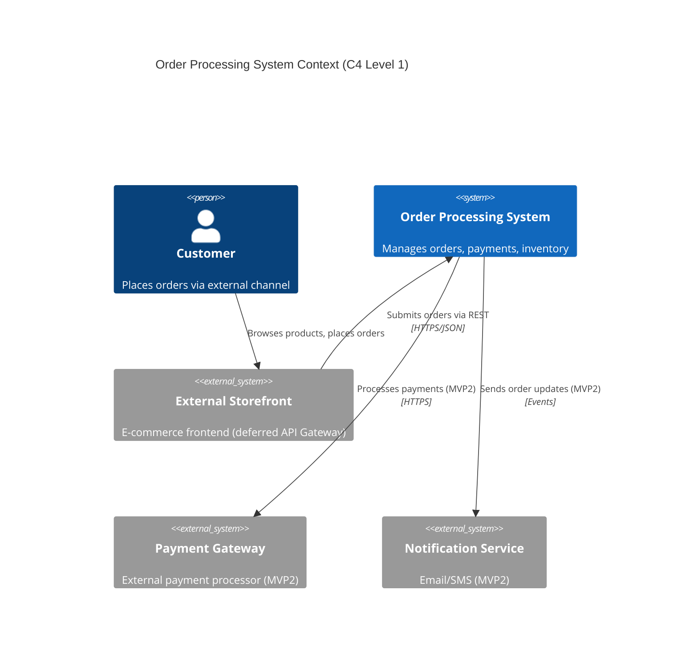

**External Actors**
- Customer: Initiates orders, expects confirmation and fulfillment
- External Storefront: Sends order requests to Order Service REST API
- Payment Gateway (MVP2): Future integration for card processing
- Notification Service (MVP2): Future integration for customer alerts

### 3.2 Technical Context

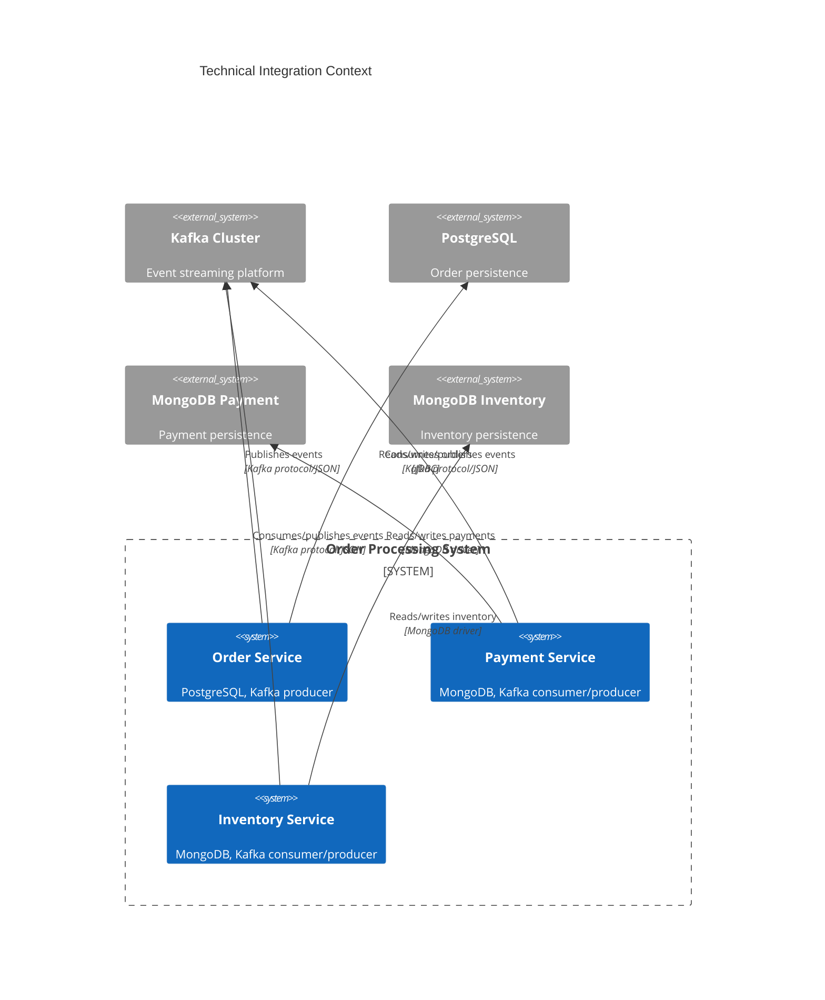

### 3.3 External Interfaces

| Interface | Protocol | Format | SLA | Notes |
|-----------|----------|--------|-----|-------|
| Order REST API | HTTPS | JSON | < 3s response | Entry point for order creation |
| Kafka Events | Kafka protocol | JSON (MVP1), AVRO (MVP2) | < 500ms delivery | Event-driven communication |
| PostgreSQL | JDBC | SQL | < 100ms query | Order transactional store |
| MongoDB (Payment/Inventory) | MongoDB driver | BSON | < 50ms read | Document stores |

## 4. Solution Strategy

### 4.1 Architecture Drivers

**Chosen Style**: Event-Driven Microservices with SAGA orchestration

**Why This Fits**:
- **Event-Driven**: Decouples services, enables scalability, supports eventual consistency
- **SAGA Pattern**: Ensures distributed transaction consistency without 2PC; compensating transactions handle failures
- **Hexagonal (Order)**: Isolates domain logic from infrastructure; easy to swap adapters (e.g., payment gateway in MVP2)
- **Vertical Slice (Payment/Inventory)**: Simpler services organized by feature; faster development for straightforward domains
- **Single DB per Service**: Strong ownership boundaries, independent scaling, schema evolution

### 4.2 Key Decisions & Tactics

| Decision | Rationale | Trade-off |
|----------|-----------|-----------|
| SAGA choreography (event-based) | No central orchestrator, services react to events | More complex to trace; mitigated with correlation IDs |
| Outbox pattern for events | Ensures exactly-once event publishing with DB transaction | Adds outbox table, polling/CDC mechanism |
| JSON events in MVP1 | Faster development, simpler debugging | No schema evolution; plan migration to AVRO in MVP2 |
| No API Gateway in MVP1 | Reduces complexity, direct service access | Clients must know service endpoints; add gateway in MVP2 |
| Deferred security in MVP1 | Focus on functional core | Must add OAuth2/JWT before production; MVP1 for internal testing only |
| Helm charts for Kubernetes deployment | Standardized packaging, templating, versioning; works across stage/prod environments | Learning curve for Helm; requires chart maintenance |
| k3s for local development (optional) | Lightweight K8s (~40MB) enables local testing of Helm charts and K8s manifests before stage deployment | Requires K8s knowledge; Docker Compose remains simpler option for basic dev workflows |

### 4.3 Quality Tactics

| Quality Attribute | Tactics Applied |
|------------------|-----------------|
| **Scalability** | Stateless services, horizontal pod autoscaling, Kafka partitioning by order ID |
| **Reliability** | Retry policies, circuit breakers, health checks, dead-letter queues for failed events |
| **Consistency** | Eventual consistency via events, compensating transactions in SAGA, idempotent consumers |
| **Observability** | Correlation IDs, structured logging (JSON), metrics (Prometheus), traces (OpenTelemetry) |
| **Maintainability** | Hexagonal/vertical slice patterns, clear package structure, ADRs for decisions |

## 5. Building Block View

### 5.1 Level 1 Whitebox - System Decomposition

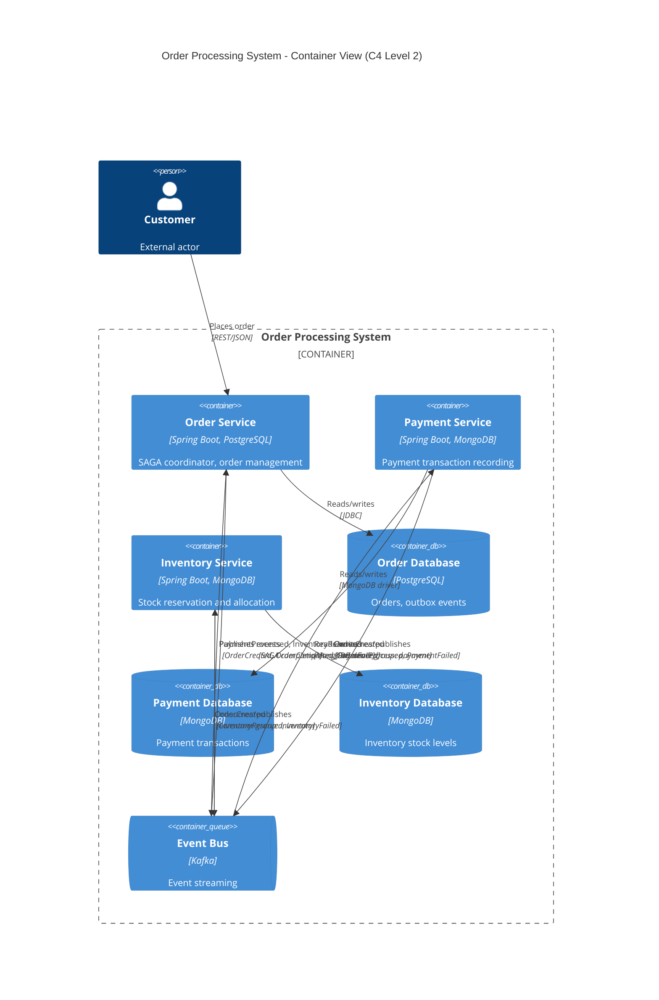

**Service Contracts**:
- **Order Service**: Exposes REST API for order creation, listens to PaymentProcessed/InventoryReserved/Failed events
- **Payment Service**: Listens to OrderCreated, publishes PaymentProcessed/PaymentFailed
- **Inventory Service**: Listens to OrderCreated, publishes InventoryReserved/InventoryFailed

### 5.2 Level 2 - Order Service (Hexagonal Architecture)

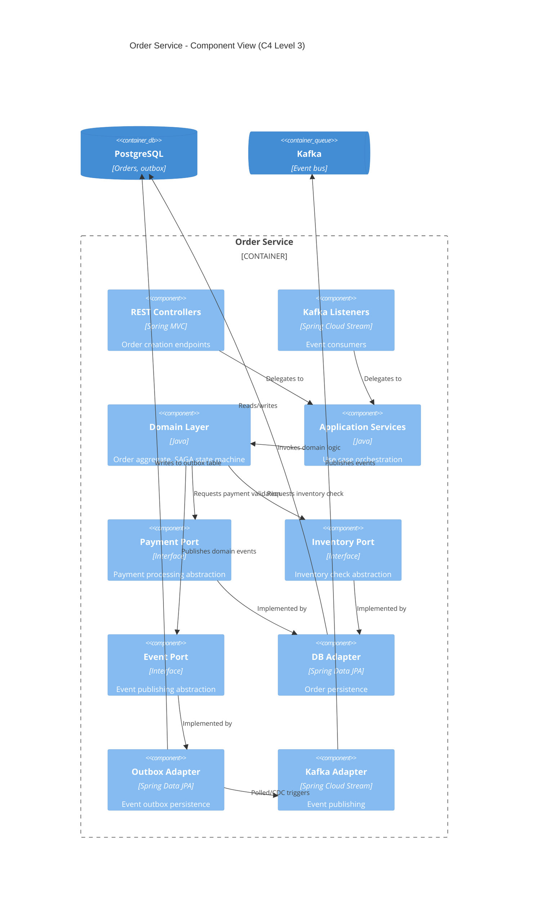

### 5.3 Level 2 - Payment Service (Vertical Slice Architecture)

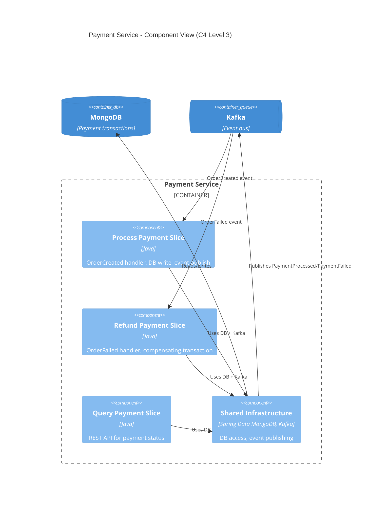

### 5.4 Level 2 - Inventory Service (Vertical Slice Architecture)

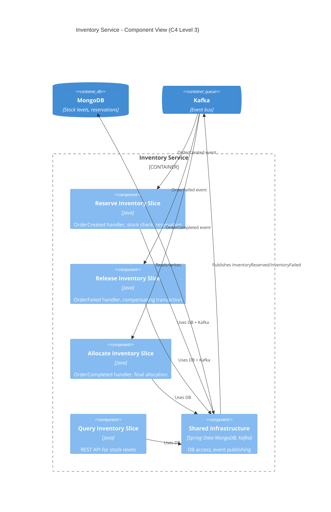

### 5.5 Modules (Package Hierarchy)

#### Order Service (Hexagonal)

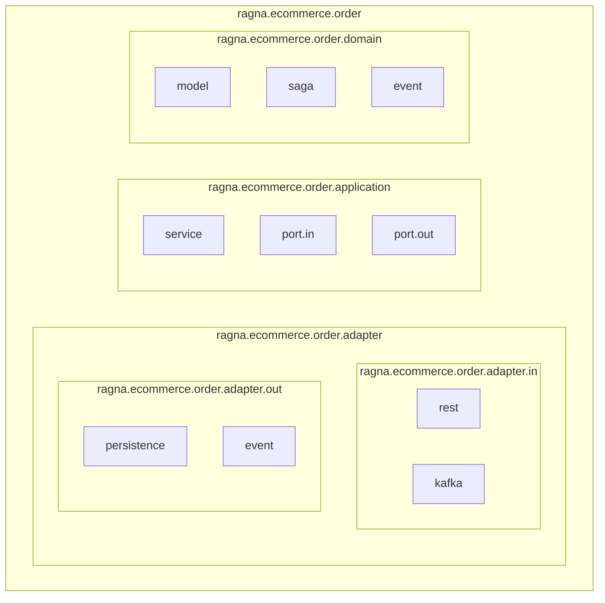

| Package | Description |
|---------|-------------|
| `ragna.ecommerce.order.adapter.in.rest` | REST controllers for order creation, query endpoints |
| `ragna.ecommerce.order.adapter.in.kafka` | Kafka listeners for SAGA completion events (PaymentProcessed, InventoryReserved, etc.) |
| `ragna.ecommerce.order.adapter.out.persistence` | JPA repositories, entity mappings for Order aggregate and outbox |
| `ragna.ecommerce.order.adapter.out.event` | Kafka producer implementation for event publishing via outbox |
| `ragna.ecommerce.order.application.service` | Use case orchestration (CreateOrderUseCase, CompleteOrderUseCase) |
| `ragna.ecommerce.order.application.port.in` | Input ports (interfaces for use cases) |
| `ragna.ecommerce.order.application.port.out` | Output ports (interfaces for persistence, event publishing) |
| `ragna.ecommerce.order.domain.model` | Order aggregate, value objects (OrderId, CustomerId, OrderItem) |
| `ragna.ecommerce.order.domain.saga` | SAGA state machine, compensation logic |
| `ragna.ecommerce.order.domain.event` | Domain events (OrderCreated, OrderCompleted, OrderFailed) |

#### Payment Service (Vertical Slice)

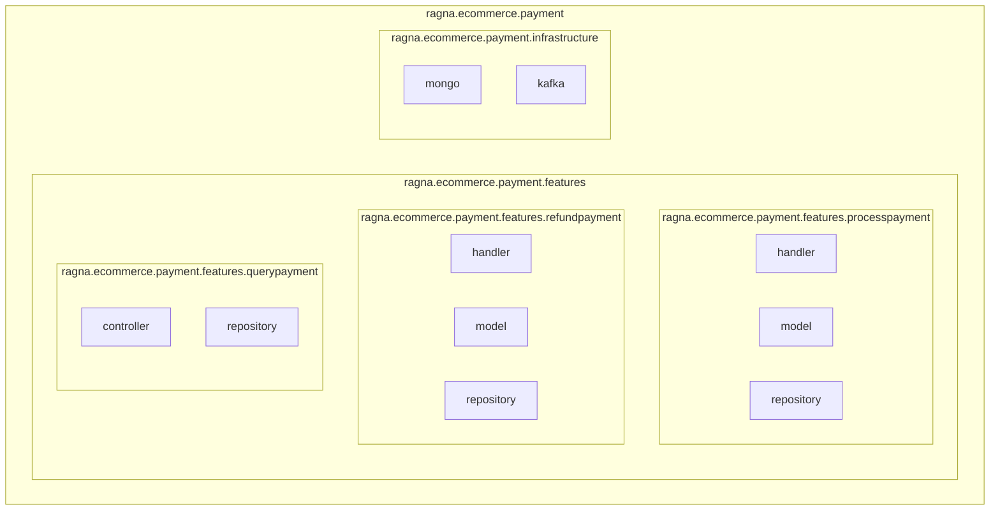

| Package | Description |
|---------|-------------|
| `ragna.ecommerce.payment.features.processpayment.handler` | Kafka listener for OrderCreated, payment processing logic |
| `ragna.ecommerce.payment.features.processpayment.model` | Payment transaction model, validation rules |
| `ragna.ecommerce.payment.features.processpayment.repository` | MongoDB repository for payment persistence |
| `ragna.ecommerce.payment.features.refundpayment.handler` | Kafka listener for OrderFailed, refund/compensation logic |
| `ragna.ecommerce.payment.features.refundpayment.model` | Refund model |
| `ragna.ecommerce.payment.features.refundpayment.repository` | MongoDB repository for refund operations |
| `ragna.ecommerce.payment.features.querypayment.controller` | REST controller for payment status queries |
| `ragna.ecommerce.payment.features.querypayment.repository` | MongoDB read repository |
| `ragna.ecommerce.payment.infrastructure.mongo` | MongoDB configuration, shared repositories |
| `ragna.ecommerce.payment.infrastructure.kafka` | Kafka producer/consumer configuration, event serialization |

#### Inventory Service (Vertical Slice)

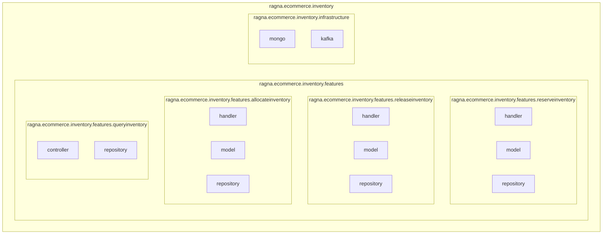

| Package | Description |
|---------|-------------|
| `ragna.ecommerce.inventory.features.reserveinventory.handler` | Kafka listener for OrderCreated, stock reservation logic |
| `ragna.ecommerce.inventory.features.reserveinventory.model` | Inventory item, reservation model |
| `ragna.ecommerce.inventory.features.reserveinventory.repository` | MongoDB repository for reservations |
| `ragna.ecommerce.inventory.features.releaseinventory.handler` | Kafka listener for OrderFailed, release reserved stock (compensation) |
| `ragna.ecommerce.inventory.features.releaseinventory.model` | Release operation model |
| `ragna.ecommerce.inventory.features.releaseinventory.repository` | MongoDB repository for release operations |
| `ragna.ecommerce.inventory.features.allocateinventory.handler` | Kafka listener for OrderCompleted, final stock allocation |
| `ragna.ecommerce.inventory.features.allocateinventory.model` | Allocation model |
| `ragna.ecommerce.inventory.features.allocateinventory.repository` | MongoDB repository for allocation |
| `ragna.ecommerce.inventory.features.queryinventory.controller` | REST controller for stock level queries |
| `ragna.ecommerce.inventory.features.queryinventory.repository` | MongoDB read repository |
| `ragna.ecommerce.inventory.infrastructure.mongo` | MongoDB configuration, shared repositories |
| `ragna.ecommerce.inventory.infrastructure.kafka` | Kafka producer/consumer configuration, event serialization |

### 5.6 API Draft - Order Service

| HTTP Method | Endpoint | Description |
|-------------|----------|-------------|
| POST | /v1/orders | Create new order (initiates SAGA) |
| GET | /v1/orders/{orderId} | Retrieve order details and status |
| GET | /v1/orders | List orders with pagination (query params: page, size, status) |
| DELETE | /v1/orders/{orderId} | Cancel order (triggers compensating transactions) |

**Example Request (POST /v1/orders)**:
```json
{
  "customerId": "CUST-12345",
  "items": [
    {"productId": "PROD-001", "quantity": 2, "pricePerUnit": 29.99},
    {"productId": "PROD-002", "quantity": 1, "pricePerUnit": 49.99}
  ],
  "shippingAddress": {
    "street": "123 Main St",
    "city": "Springfield",
    "state": "IL",
    "zip": "62701"
  }
}
```

**Example Response (201 Created)**:
```json
{
  "orderId": "ORD-78910",
  "status": "PENDING",
  "totalAmount": 109.97,
  "createdAt": "2025-11-25T10:30:00Z"
}
```

### 5.7 API Draft - Payment Service

| HTTP Method | Endpoint | Description |
|-------------|----------|-------------|
| GET | /v1/payments/{paymentId} | Retrieve payment transaction details |
| GET | /v1/payments?orderId={orderId} | List payments for specific order |

### 5.8 API Draft - Inventory Service

| HTTP Method | Endpoint | Description |
|-------------|----------|-------------|
| GET | /v1/inventory/{productId} | Get stock level for product |
| GET | /v1/inventory | List all inventory with stock levels (pagination: page, size) |

### 5.9 Async API Draft

| Channel | Producer | Message Types | Payload Name | Purpose | Known Consumers |
|---------|----------|---------------|--------------|---------|-----------------|
| `order.events` | Order Service | OrderCreated, OrderCompleted, OrderFailed, OrderCancelled | OrderEvent | Broadcasts order lifecycle events to trigger SAGA participants | Payment Service, Inventory Service |
| `payment.events` | Payment Service | PaymentProcessed, PaymentFailed | PaymentEvent | Notifies Order Service of payment processing outcome | Order Service |
| `inventory.events` | Inventory Service | InventoryReserved, InventoryFailed, InventoryAllocated | InventoryEvent | Notifies Order Service of inventory reservation/allocation outcome | Order Service |

**Event Schemas (MVP1 - JSON)**:

**OrderCreated Event**:
```json
{
  "eventId": "evt-uuid",
  "eventType": "OrderCreated",
  "timestamp": "2025-11-25T10:30:00Z",
  "correlationId": "corr-uuid",
  "payload": {
    "orderId": "ORD-78910",
    "customerId": "CUST-12345",
    "items": [
      {"productId": "PROD-001", "quantity": 2, "pricePerUnit": 29.99}
    ],
    "totalAmount": 109.97
  }
}
```

**PaymentProcessed Event**:
```json
{
  "eventId": "evt-uuid",
  "eventType": "PaymentProcessed",
  "timestamp": "2025-11-25T10:30:05Z",
  "correlationId": "corr-uuid",
  "payload": {
    "paymentId": "PAY-001",
    "orderId": "ORD-78910",
    "amount": 109.97,
    "status": "SUCCESS"
  }
}
```

**InventoryReserved Event**:
```json
{
  "eventId": "evt-uuid",
  "eventType": "InventoryReserved",
  "timestamp": "2025-11-25T10:30:06Z",
  "correlationId": "corr-uuid",
  "payload": {
    "reservationId": "RES-001",
    "orderId": "ORD-78910",
    "items": [
      {"productId": "PROD-001", "quantityReserved": 2}
    ]
  }
}
```

**OrderFailed Event** (triggers compensations):
```json
{
  "eventId": "evt-uuid",
  "eventType": "OrderFailed",
  "timestamp": "2025-11-25T10:30:07Z",
  "correlationId": "corr-uuid",
  "payload": {
    "orderId": "ORD-78910",
    "reason": "INSUFFICIENT_INVENTORY",
    "compensations": ["REFUND_PAYMENT", "RELEASE_INVENTORY"]
  }
}
```

## 6. Runtime View

### 6.1 Happy-Path Scenario - Order Creation SAGA

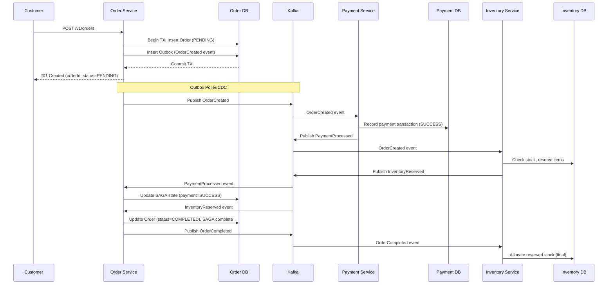

### 6.2 Failure/Degraded Scenario - Payment Fails

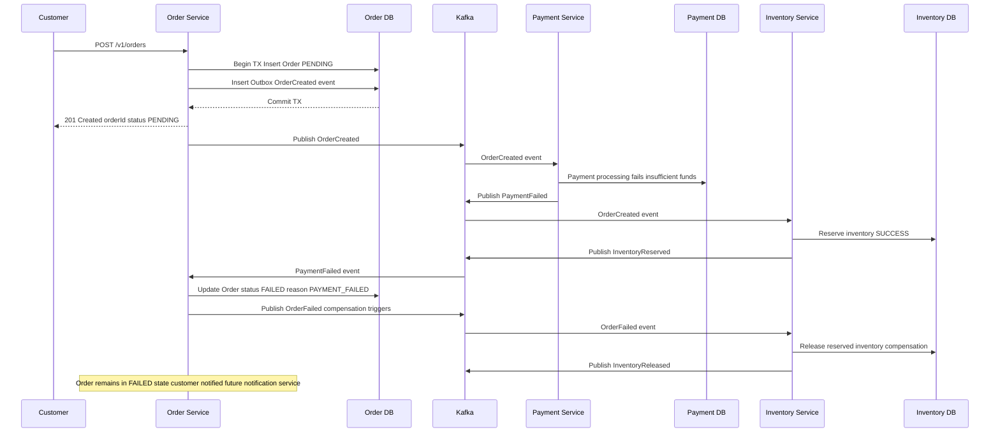

### 6.3 SAGA State Diagram

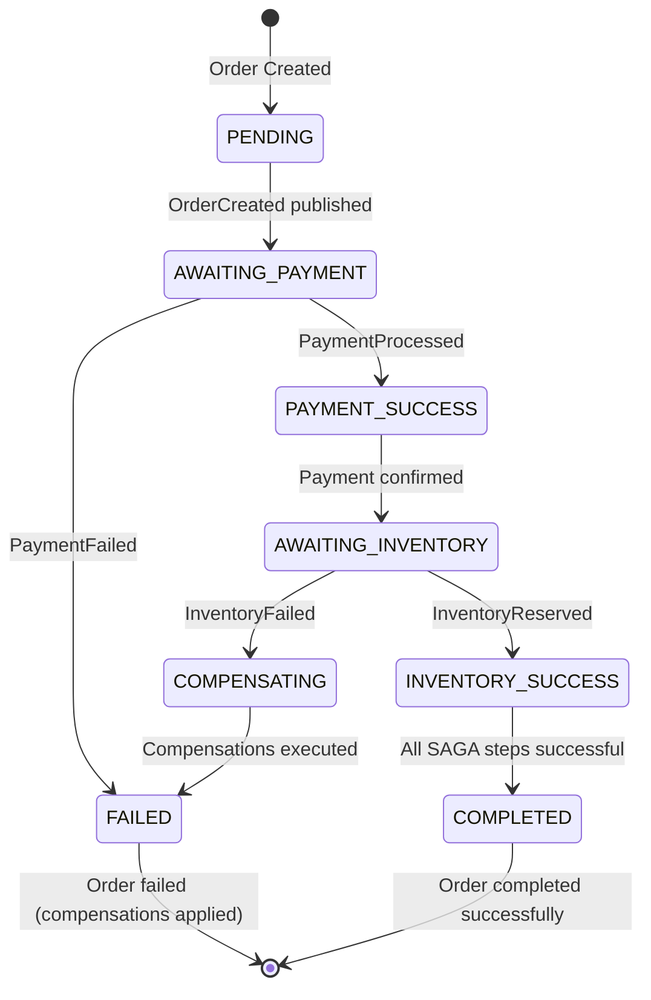

**State Descriptions**:
- **PENDING**: Order created, awaiting SAGA initiation
- **AWAITING_PAYMENT**: OrderCreated event published, waiting for PaymentProcessed
- **PAYMENT_SUCCESS**: Payment confirmed, waiting for inventory reservation
- **AWAITING_INVENTORY**: Payment successful, waiting for InventoryReserved
- **INVENTORY_SUCCESS**: Both payment and inventory successful
- **COMPLETED**: SAGA completed, order fulfilled
- **COMPENSATING**: One or more SAGA steps failed, executing compensations
- **FAILED**: SAGA failed, compensations applied (e.g., refund payment, release inventory)

## 7. Deployment View

### 7.1 Environment Overview

| Environment | Purpose | Topology | Data Strategy |
|-------------|---------|----------|---------------|
| **dev** | Local development | **Docker Compose** (all services + Kafka + DBs) OR **k3s** (lightweight Kubernetes) - both supported for flexibility | Ephemeral containers, seed data scripts |
| **stage** | Pre-production testing | Kubernetes cluster (3 nodes), managed Kafka, PostgreSQL RDS, MongoDB Atlas | Anonymized production data subset |
| **prod** | Production | Kubernetes cluster (multi-AZ, auto-scaling), managed Kafka, PostgreSQL RDS (multi-AZ), MongoDB Atlas (replica sets) | Full dataset, point-in-time backups |

**Development Environment Options**:

- **Docker Compose**: Simpler setup, minimal resource usage, ideal for quick local testing and feature development
  - Single `docker-compose.yml` orchestrates all services, Kafka, PostgreSQL, MongoDB
  - Fast startup/teardown, no Kubernetes complexity
  - Best for: Individual developer workflows, unit/integration testing

- **k3s**: Lightweight Kubernetes (https://k3s.io/), provides production-like environment locally
  - Minimal K8s distribution (~40MB), runs on laptops/workstations
  - Supports Helm charts, manifests, and Kubernetes features
  - Enables testing of deployment configs, service mesh, ingress controllers locally
  - Best for: Testing Helm charts, validating Kubernetes manifests before stage deployment, learning K8s workflows

### 7.2 Infrastructure Map

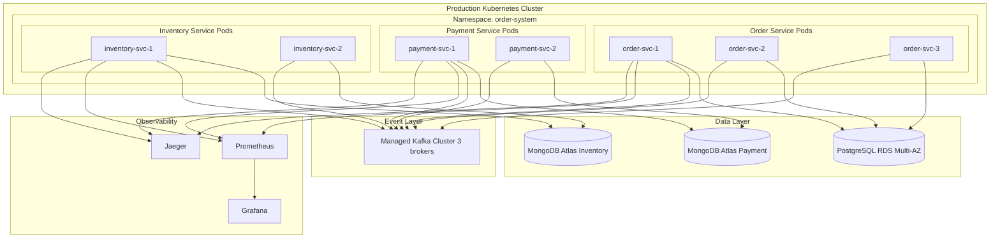

**Scaling Units**:
- Order Service: 3-10 pods (HPA based on CPU/memory, requests per second)
- Payment Service: 2-5 pods (HPA based on Kafka consumer lag)
- Inventory Service: 2-5 pods (HPA based on Kafka consumer lag)
- Kafka: 3 brokers minimum (replication factor 3)
- PostgreSQL: Primary + standby (auto-failover)
- MongoDB: 3-node replica set per database

### 7.3 Deployment & Ops

**CI/CD Pipeline**:
1. **Build**: Maven build, unit tests, code coverage (JaCoCo)
2. **Test**: Integration tests (Testcontainers for Kafka/DBs), contract tests (Pact)
3. **Publish**: Docker image push to container registry, tag with git commit SHA
4. **Deploy Dev**: Auto-deploy to dev environment on main branch merge
5. **Deploy Stage**: Manual approval, deploy to stage, run smoke tests
6. **Deploy Prod**: Manual approval, blue-green deployment with 10% canary, monitor metrics for 30 minutes, full rollout or rollback

**Feature Flags**:
- Use LaunchDarkly or custom Spring-based flag service
- Flags for MVP2 features (API Gateway, AVRO serialization, external payment gateway)
- Gradual rollout: 1% -> 10% -> 50% -> 100% with automatic rollback on error rate increase

**Observability Hooks**:
- **Metrics**: Spring Actuator + Micrometer (Prometheus format)
  - Order creation rate, SAGA completion rate, event processing latency
  - DB connection pool stats, Kafka consumer lag
- **Logs**: JSON structured logs with correlation IDs, shipped to centralized log aggregator (ELK/Loki)
- **Traces**: OpenTelemetry instrumentation, exported to Jaeger
  - Distributed traces across order SAGA lifecycle
- **Health Checks**: `/actuator/health` (readiness: DB + Kafka connectivity, liveness: application alive)

**Rollback Strategy**:
- Blue-green deployment: Keep previous version running, switch traffic via service selector
- Database migrations: Backward-compatible schemas (expand/contract pattern)
- Event schema evolution: JSON in MVP1 (additive changes only), AVRO in MVP2 (schema registry)

## 8. Crosscutting Concepts

### 8.1 Domain & Data Concepts

**Ubiquitous Language**:
- **Order**: Customer request to purchase products, tracked through SAGA lifecycle
- **Order Item**: Individual product with quantity and price within an order
- **SAGA**: Distributed transaction pattern coordinating payment and inventory
- **Compensating Transaction**: Rollback action when SAGA step fails (e.g., refund payment)
- **Payment Transaction**: Record of payment processing attempt (MVP1: local DB, MVP2: gateway)
- **Inventory Reservation**: Temporary stock allocation pending order completion
- **Inventory Allocation**: Final stock reduction after order completion

**Data Model (Level 1 - Domain/Conceptual)**:

#### Order Service (PostgreSQL)

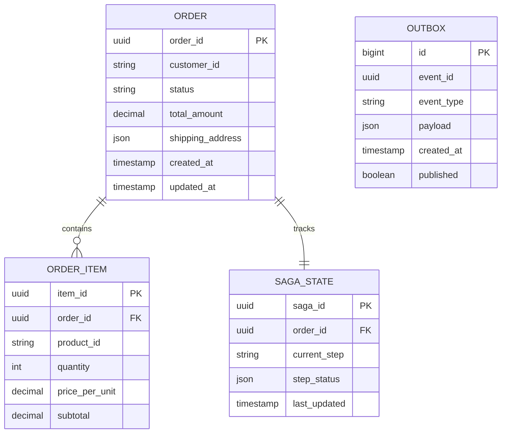

**Field Details**:
- **ORDER.status**: Values include PENDING, AWAITING_PAYMENT, PAYMENT_SUCCESS, AWAITING_INVENTORY, COMPLETED, FAILED, COMPENSATING
- **ORDER.shipping_address**: JSON/JSONB containing street, city, state, zip
- **SAGA_STATE.current_step**: Values include PENDING, PAYMENT_PROCESSING, INVENTORY_RESERVING, COMPLETED, FAILED
- **SAGA_STATE.step_status**: JSON/JSONB tracking status of each SAGA participant (payment, inventory)
- **OUTBOX.event_type**: Event name (OrderCreated, OrderCompleted, OrderFailed, etc.)
- **OUTBOX.payload**: JSON/JSONB event data
- **OUTBOX.published**: Boolean flag indicating if event was published to Kafka

#### Payment Service (MongoDB)

```javascript
// Collection: payments
{
  _id: ObjectId,                       // PK
  payment_id: UUID,                    // Application-level unique ID
  order_id: UUID,                      // → orders (reference)
  customer_id: String,
  amount: Decimal128,
  currency: String,                    // "USD"
  status: String,                      // "SUCCESS", "FAILED", "PENDING"
  payment_method: {                    // MVP1: placeholder, MVP2: gateway details
    type: String,                      // "CREDIT_CARD", "DEBIT_CARD"
    last_four_digits: String
  },
  transaction_timestamp: Date,
  failure_reason: String,              // Optional, present if status=FAILED
  created_at: Date,
  updated_at: Date
}
// Indexes:
// - { payment_id: 1 } unique
// - { order_id: 1 }
// - { customer_id: 1, created_at: -1 }
```

#### Inventory Service (MongoDB)

```javascript
// Collection: inventory_items
{
  _id: ObjectId,                       // PK
  product_id: String,                  // Unique product identifier
  available_stock: Number,             // Current available quantity
  reserved_stock: Number,              // Quantity reserved pending orders
  allocated_stock: Number,             // Quantity allocated to completed orders
  total_stock: Number,                 // available + reserved + allocated
  warehouse_location: String,
  updated_at: Date
}
// Indexes:
// - { product_id: 1 } unique
// - { available_stock: 1 }

// Collection: reservations
{
  _id: ObjectId,                       // PK
  reservation_id: UUID,                // Application-level unique ID
  order_id: UUID,                      // → orders (reference)
  items: [                             // Array of reserved items
    {
      product_id: String,              // → inventory_items
      quantity_reserved: Number
    }
  ],
  status: String,                      // "RESERVED", "ALLOCATED", "RELEASED"
  created_at: Date,
  updated_at: Date,
  expires_at: Date                     // TTL for auto-release if order not completed
}
// Indexes:
// - { reservation_id: 1 } unique
// - { order_id: 1 }
// - { expires_at: 1 } TTL index
```

**Schema Ownership**:
- Order Service owns `orders`, `order_items`, `saga_state`, `outbox` schemas
- Payment Service owns `payments` schema
- Inventory Service owns `inventory_items`, `reservations` schemas
- No shared databases; services communicate via events only

### 8.2 Security & Compliance

**Authentication/Authorization (Deferred to MVP2)**:
- MVP1: No authentication (internal testing only, trusted network)
- MVP2: OAuth2/OIDC with JWT tokens
  - API Gateway validates tokens, forwards claims to services
  - Service-to-service: mTLS or JWT propagation

**Threat Model (High-Level)**:
| Threat | Mitigation (MVP2) | MVP1 Status |
|--------|-------------------|-------------|
| Unauthorized API access | API Gateway with OAuth2 | Deferred (internal testing) |
| Event tampering | Kafka TLS + SASL authentication | TLS enabled, no auth |
| SQL injection | Parameterized queries (already in Spring Data JPA) | Applied |
| NoSQL injection | MongoDB driver sanitization, JSON schema validation | Applied |
| Data breach | Encryption at rest (RDS/MongoDB Atlas), in transit (TLS) | TLS only (MVP1) |

**Privacy Controls**:
- PII fields (customer address, payment details) encrypted in MVP2
- GDPR compliance: Customer data deletion API (MVP2)

### 8.3 Resilience & Performance

**Resilience Patterns**:
| Pattern | Implementation | Configuration |
|---------|----------------|---------------|
| **Circuit Breaker** | Resilience4j on Kafka producer | 50% failure rate, 10s open duration |
| **Retry** | Spring Retry on Kafka consumers | Exponential backoff: 1s, 2s, 4s, max 3 retries |
| **Timeout** | HTTP client timeouts (RestTemplate/WebClient) | Connect: 2s, Read: 5s |
| **Bulkhead** | Thread pool isolation per Kafka consumer | Max threads: 10 per consumer group |
| **Idempotency** | Event ID deduplication in consumers | Store processed event IDs in DB (TTL 7 days) |
| **Dead Letter Queue** | Kafka DLQ for failed events | Manual review, replay tooling |

**Caching Strategy**:
- Inventory stock levels: Redis cache (TTL 30s) for read-heavy queries
- Payment status: No caching (always query DB for authoritative state)
- Order details: Redis cache (TTL 60s) for GET /orders/{orderId}

**Async Processing**:
- All SAGA coordination is async via Kafka events
- Outbox pattern ensures exactly-once event publishing with DB transaction

**Performance Targets**:
- Order creation (POST /orders): < 200ms response (order persisted, event in outbox)
- SAGA completion (end-to-end): < 3s (p95)
- Event processing latency: < 500ms (consumer lag)
- Database queries: < 100ms (p95)

### 8.4 Operations & Automation

**CI/CD Tooling**:
- Git: GitHub (main, develop branches, feature branches)
- Build: GitHub Actions (Maven, Docker)
- Artifact Storage: Docker Hub / AWS ECR
- Deployment: ArgoCD (GitOps, Kubernetes manifests in separate repo)

**Feature Flags**:
- Library: Togglz (Spring Boot integration)
- Flags managed via admin UI or environment variables
- Example flags:
  - `ENABLE_API_GATEWAY`: false (MVP1), true (MVP2)
  - `ENABLE_AVRO_SERIALIZATION`: false (MVP1), true (MVP2)
  - `ENABLE_EXTERNAL_PAYMENT_GATEWAY`: false (MVP1), true (MVP2)

**Migration Tooling**:
- PostgreSQL: Flyway for schema migrations (versioned SQL scripts)
- MongoDB: Custom migration scripts (versioned, idempotent)
- Event schema evolution: JSON in MVP1 (additive changes), AVRO in MVP2 (schema registry)

**Rollout Strategy**:
- Blue-green deployment for zero-downtime releases
- Canary: 10% traffic to new version, monitor error rate for 30 minutes
- Automated rollback if error rate > 1% or p95 latency > 5s

**Monitoring Dashboards**:
- **Order Service**: Order creation rate, SAGA completion rate, failure reasons breakdown
- **Payment Service**: Payment success rate, processing latency
- **Inventory Service**: Reservation success rate, stock levels
- **Kafka**: Consumer lag per topic, event throughput, replication lag
- **Infrastructure**: Pod CPU/memory, DB connection pool, query latency

## 9. Architecture Decisions

### 9.1 Accepted ADRs

| ID | Title | Status | Date |
|----|-------|--------|------|
| [ADR-0001](adrs/adr-0001.md) | Use SAGA Choreography for Distributed Transactions | Accepted | 2025-11-25 |
| [ADR-0002](adrs/adr-0002.md) | Hexagonal Architecture for Order Service | Accepted | 2025-11-25 |
| [ADR-0003](adrs/adr-0003.md) | Vertical Slice Architecture for Payment and Inventory Services | Accepted | 2025-11-25 |
| [ADR-0004](adrs/adr-0004.md) | Single Database per Service | Accepted | 2025-11-25 |
| [ADR-0005](adrs/adr-0005.md) | Outbox Pattern for Event Publishing | Accepted | 2025-11-25 |
| [ADR-0006](adrs/adr-0006.md) | Defer Payment Gateway Integration to MVP2 | Accepted | 2025-11-25 |
| [ADR-0007](adrs/adr-0007.md) | Defer API Gateway to MVP2 | Accepted | 2025-11-25 |
| [ADR-0008](adrs/adr-0008.md) | Use JSON for Event Serialization in MVP1 | Accepted | 2025-11-25 |
| [ADR-0009](adrs/adr-0009.md) | Defer Security Integration to MVP2 | Accepted | 2025-11-25 |
| [ADR-0010](adrs/adr-0010.md) | PostgreSQL for Order Service, MongoDB for Payment and Inventory | Accepted | 2025-11-25 |
| [ADR-0011](adrs/adr-0011.md) | Mono-Repository with Independent Services | Accepted | 2025-11-25 |

### 9.2 Pending/Planned Decisions

| ID | Title | Status | Notes |
|----|-------|--------|-------|
| ADR-0012 | Schema Registry Selection (MVP2) | Planned | Evaluate Confluent Schema Registry vs Apicurio |
| ADR-0013 | API Gateway Technology (MVP2) | Planned | Kong vs Spring Cloud Gateway vs AWS API Gateway |
| ADR-0014 | OAuth2 Provider Selection (MVP2) | Planned | Keycloak vs Auth0 vs AWS Cognito |
| ADR-0015 | Observability Stack Finalization | Planned | Prometheus/Grafana vs Datadog vs New Relic |

## 10. Quality Requirements

### 10.1 Quality Tree

```
Quality Requirements
├── Performance (Priority: High)
│   ├── Order creation response time < 200ms (p95)
│   ├── SAGA completion < 3s (p95)
│   └── Event processing latency < 500ms
├── Reliability (Priority: High)
│   ├── System uptime 99.5%
│   ├── SAGA completion rate > 99%
│   └── Zero data loss (events, transactions)
├── Scalability (Priority: High)
│   ├── Handle 10x order volume
│   ├── Horizontal pod autoscaling (3-10 pods per service)
│   └── Kafka partition scaling (10 partitions per topic)
├── Maintainability (Priority: Medium)
│   ├── Independent service deployments
│   ├── Clear architectural patterns (Hexagonal, Vertical Slice)
│   └── Comprehensive test coverage (>80%)
├── Security (Priority: Medium - MVP2)
│   ├── OAuth2/OIDC authentication
│   ├── Encryption at rest and in transit
│   └── Audit logging for sensitive operations
└── Evolvability (Priority: Medium)
    ├── Feature flags for gradual rollout
    ├── Backward-compatible event schemas
    └── API versioning strategy
```

### 10.2 Quality Scenarios

| Scenario ID | Quality Attribute | Stimulus | Environment | Response | Metric |
|-------------|------------------|----------|-------------|----------|--------|
| QS-1 | Performance | 1000 concurrent order requests | Production, normal load | Orders created, events in outbox | < 200ms response time (p95) |
| QS-2 | Reliability | Payment Service crashes during SAGA | Production, peak load | Order Service detects timeout, triggers compensation | SAGA marked FAILED within 10s, compensation executed |
| QS-3 | Scalability | Order volume increases 5x overnight | Production, Black Friday | Kubernetes HPA scales Order Service to 10 pods | No degradation, < 3s SAGA completion maintained |
| QS-4 | Maintainability | Developer adds new SAGA step (shipping) | Development | New port/adapter added to Order Service, event published | < 2 days implementation, no existing code changes |
| QS-5 | Security (MVP2) | Unauthorized user attempts order creation | Production | API Gateway rejects request (401 Unauthorized) | < 50ms rejection, logged to audit trail |
| QS-6 | Evolvability | Enable AVRO serialization (MVP2) | Staging | Feature flag toggled, services consume AVRO events | Zero downtime, backward-compatible with JSON |

## 11. Risks & Technical Debt

### 11.1 Risk Register

| Risk ID | Description | Probability | Impact | Mitigation | Owner |
|---------|-------------|-------------|--------|------------|-------|
| R-1 | SAGA orchestration complexity leads to debugging challenges | High | Medium | Implement correlation IDs, distributed tracing (Jaeger), SAGA state dashboard | Development Team |
| R-2 | Kafka consumer lag spikes during peak load | Medium | High | Monitor consumer lag, scale consumers dynamically, increase partition count | Operations Team |
| R-3 | Outbox polling/CDC lag causes event delay | Medium | Medium | Use CDC (Debezium) for near-real-time event publishing, monitor outbox table size | Development Team |
| R-4 | MongoDB eventual consistency causes inventory overselling | Low | High | Use MongoDB transactions for stock reservation, implement optimistic locking | Development Team |
| R-5 | MVP1 lacks security, accidental production exposure | Low | Critical | Deploy MVP1 only in internal/dev environments, gate production deploy on MVP2 security ADRs | Architects |
| R-6 | Event schema breaking changes in MVP1 (JSON) | Medium | Medium | Enforce additive-only changes, plan AVRO migration for MVP2 | Architects |
| R-7 | Database migration failures during deployment | Low | High | Test migrations in staging, implement rollback scripts, use Flyway versioning | Operations Team |

### 11.2 Technical Debt Backlog

| Debt ID | Description | Impact | Remediation Plan | Target Release |
|---------|-------------|--------|------------------|----------------|
| TD-1 | JSON event serialization (no schema validation) | Medium | Migrate to AVRO with schema registry | MVP2 |
| TD-2 | No API Gateway (clients know service URLs) | Medium | Introduce Kong/Spring Cloud Gateway | MVP2 |
| TD-3 | No authentication/authorization | High | Implement OAuth2/OIDC with API Gateway | MVP2 |
| TD-4 | Payment service uses local DB (not real gateway) | Medium | Integrate with Stripe/PayPal gateway | MVP2 |
| TD-5 | Outbox polling (not CDC) | Low | Replace with Debezium CDC | MVP2 or post-MVP2 |
| TD-6 | Limited observability (no distributed tracing) | Medium | Integrate OpenTelemetry + Jaeger | MVP1.5 |
| TD-7 | No customer notification service | Low | Build notification service (email/SMS) | Post-MVP2 |

### 11.3 Validation Tasks

| Task ID | Description | Type | Owner | Status |
|---------|-------------|------|-------|--------|
| VT-1 | Load test SAGA completion under 1000 orders/sec | Performance | QA Team | Planned |
| VT-2 | Chaos engineering: Kill Payment Service during SAGA | Reliability | Operations Team | Planned |
| VT-3 | Test MongoDB transaction isolation for inventory reservation | Correctness | Development Team | Planned |
| VT-4 | Validate outbox pattern with CDC (Debezium) | Technical Spike | Development Team | Planned |
| VT-5 | Security audit of MVP2 OAuth2 integration | Security | Security Auditor | Deferred to MVP2 |
| VT-6 | Benchmark JSON vs AVRO event serialization | Performance | Development Team | Planned |

## 12. Glossary

### 12.1 Domain Terms

| Term | Definition | Context |
|------|------------|---------|
| **Order** | A customer's request to purchase products, containing items, quantities, and pricing | Core domain entity in Order Service |
| **Order Item** | Individual product within an order, specifying product ID, quantity, and price | Part of Order aggregate |
| **SAGA** | Distributed transaction pattern coordinating multiple services with compensating transactions | Order Service SAGA coordinator |
| **Compensating Transaction** | Rollback operation executed when a SAGA step fails (e.g., refund payment, release inventory) | SAGA failure handling |
| **Payment Transaction** | Record of payment processing attempt, success/failure status | Payment Service domain entity |
| **Inventory Reservation** | Temporary allocation of stock for pending order | Inventory Service operation |
| **Inventory Allocation** | Final stock reduction when order completes successfully | Inventory Service operation |
| **Outbox** | Table storing events to be published, ensuring exactly-once delivery with DB transaction | Event publishing pattern |

### 12.2 Acronyms & Abbreviations

| Acronym | Expansion | Usage Notes |
|---------|-----------|-------------|
| **SAGA** | Long-lived transaction pattern | Named after original research paper, not an acronym |
| **CDC** | Change Data Capture | Technique for publishing DB changes as events (e.g., Debezium) |
| **HPA** | Horizontal Pod Autoscaler | Kubernetes resource for auto-scaling pods |
| **RDS** | Relational Database Service | AWS managed PostgreSQL service |
| **TTL** | Time To Live | Expiration mechanism for cached data or temporary records |
| **AVRO** | N/A (not an acronym) | Binary serialization format from Apache Avro project |
| **BSON** | Binary JSON | MongoDB's binary-encoded JSON format |
| **mTLS** | Mutual TLS | Two-way TLS authentication between services |
| **RBAC** | Role-Based Access Control | Authorization model (deferred to MVP2) |
| **OIDC** | OpenID Connect | Authentication layer on OAuth2 (deferred to MVP2) |

### 12.3 Ubiquitous Language Alignment

**Team Communication Guidelines**:
- Always use "SAGA" (not "distributed transaction", "two-phase commit")
- "Compensating Transaction" (not "rollback", "undo")
- "Event Publishing" (not "messaging", "notification")
- "Outbox Pattern" (not "transactional event publishing")
- "Inventory Reservation" (not "stock lock", "hold")
- "Payment Transaction" (not "payment record", "payment entry")

**Cross-Team Terminology**:
- Order Service uses "SAGA State" internally but publishes "OrderCreated/Completed/Failed" events
- Payment Service refers to "Payment Transaction" internally, publishes "PaymentProcessed/Failed" events
- Inventory Service uses "Reservation" and "Allocation" as distinct operations
- All teams use "Correlation ID" for tracing distributed workflows

---

**Document Version**: 1.0
**Last Updated**: 2025-11-25
**Status**: Initial Architecture for MVP1
**Next Review**: After MVP1 implementation, before MVP2 planning
